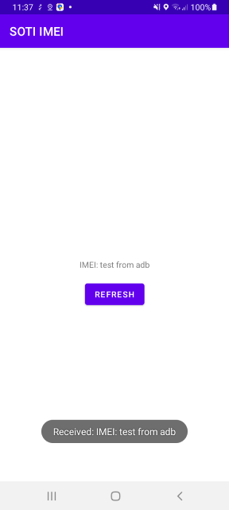

# SOTI-IMEI
An Android app that on a SOTI managed device receives IMEI from MobiControl agent.

## Why?

As almost all Android developers know, [since Android 10](https://developer.android.com/training/articles/user-data-ids) the apps cannot have any unique identifier to distinguish a specific device for the sake of user privacy which is fine from the user perspective but if you are developing for a company that has enterprise-managed devices and like to know which device is talking with the backend to white list them then it makes sense to have something like IMEI as a unique ID.
The good news is if you are using the [SOTI MobiControl device manager solution]((https://soti.net/solutions/enterprise-mobility-management)), there is a solution to ask their Agent that has access to Android Enterprise APIs to pass you the Device IMEI value!

## How does it works?
This app has a simple [IMEI Broadcast receiver](app/src/main/java/com/mohsenoid/android/soti/imei/ImeiReceiver.kt) which receives a message from SOTI MobiControl Agent and stores it.

## How to test?
Using ADB you can send this broadcast message intent to test how app works:

`adb shell am broadcast -a com.mohsenoid.android.soti.imei.ACTION --es imei "IMEI\ from\ ADB" -n com.mohsenoid.android.soti.imei/.ImeiReceiver`

## SOTI MobiControl Script
Using the [`sendintent` command in SOTI scripts](https://www.soti.net/mc/help/v14.0/en/scriptcmds/reference/sendintent.html) the IMEI Broadcast receiver receives the IMEI value from the [`%IMEI%` macro](https://www.soti.net/mc/help/v14.0/en/console/other/macros.html):

`sendintent -b "intent:#Intent;action=com.mohsenoid.android.soti.imei.ACTION;S.imei=%IMEI%;component=com.mohsenoid.android.soti.imei/.ImeiReceiver;end;"`
